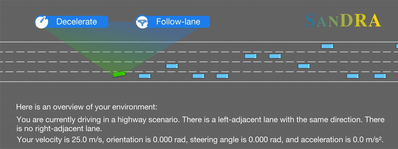

<div align="center">

<h1>SanDRA</h1>
<h3>Safe LLM-based Decision-making for Automated Vehicles</h3>

[Yuanfei Lin](https://yuanfei-lin.github.io/)<sup>\*, ✉</sup>, [Sebastian Illing](https://www.linkedin.com/in/sebastian-illing-6099a4336/)<sup>\*</sup>, [Matthias Althoff](https://www.ce.cit.tum.de/cps/members/prof-dr-ing-matthias-althoff/)

Technical University of Munich

(\*) Equal contribution. (✉) Corresponding author.  

<a href="https://commonroad.github.io/SanDRA/">
<a href="https://www.python.org/">
  
</a>
<a href="https://isocpp.org/">
  
</a>

<p align="center">
  
</p>
 </div>


## ⚙️ Setup
For using **SanDRA** with OpenAI models, you need an OpenAI API-key. Make sure to export it as environment variable named **OPENAI_API_KEY**.
If you'd rather use local models, you can follow the instructions in section **Run with local LLMs**.

## 📦 Dependencies for Reachability Analysis  
For leveraging reachability analysis you need to install
* [commonroad-reach-semantic](https://github.com/CommonRoad/commonroad-reach-semantic/tree/feature/sandra): branch `feature/sandra` 
(use `export CXX=/usr/bin/g++-10` before installation to use the correct compiler, the whole installation process might take **more than 10 minutes**.)
> **Note:** After installation, please go to `~/SanDRA/sandra/config.py` and update `COMMONROAD_REACH_SEMANTIC_ROOT` to the directory where you installed `commonroad-reach-semantic`.

##  📦 Dependencies for Set-based Predictions
For set-based predictions, you need to install
* [sonia (spot)](https://github.com/CommonRoad/spot-sonia): branch `master` (`python setup.py install`)

## 🔄 Roadmap  

- [x] 📄 Release Paper  
- [x] 📦 Release Code
- [x] 🌐 Release Project Page
- [ ] 📑 Release Updated Paper  


## ▶️ Main scripts
There are 2 ways to test SanDRA:
1. With a [CommonRoad](https://commonroad.in.tum.de/) scenario.
2. With the [highwayenv](https://highway-env.farama.org/).

*commonroad_run.py* and  *highwayenv_run.py* illustrate how to run SanDRA decision making in either of these cases. Please make sure to prepare the seeds for highwayenv / the scenarios for CommonRoad beforehand.

## 🖥️ Run with local LLMs
To run SanDRA with local models, you need to follow these steps:
1. 📥 Download [Ollama](https://ollama.com/download)
2. ⚙️ Install Go (Recommended):
```bash
sudo apt update
sudo apt install golang-go
```
3. 🤖 Download a model (We recommend to use a model with >=8B parameters to avoid problems with structured outputs):
```bash
ollama pull qwen3:8b
```
4. ▶️ Start the Ollama server
```bash
ollama serve
```
## 📝 Cite Us  

If you use **SanDRA** in your research, please cite:  

```bibtex
@article{lin2025sandra,
  title     = {SanDRA: Safe Large-Language-Model-Based Decision Making for Automated Vehicles Using Reachability Analysis},
  author    = {Yuanfei Lin and Sebastian Illing and Matthias Althoff},
  journal   = {arXiv preprint arXiv:2501.xxxxx}, 
  year      = {2025}
}